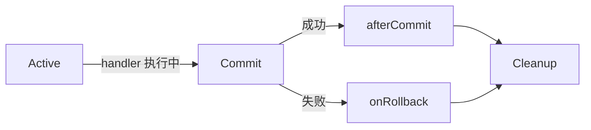

# Axon Framework

两周之前就布置下了任务，研究系统最近上线的Axon消息失败重试机制。but Axon 是什么？😂

<br>

todo：

1.阅读官方手册，整理核心概念，构建大致框架。

2.新增demo，项目中实践一下相关概念。

3.梳理当前项目中的Axon实践 todo...

<br>

<br>

# 核心概念地图


<br>


## 总览：


<br>

<br>

## 消息关联:

> 非常好的问题！你提到的 [Axon 官方文档 — Message Correlation](https://docs.axoniq.io/axon-framework-reference/4.11/messaging-concepts/message-correlation/) 确实写得比较简略，术语密集，初看容易困惑。下面我们**从零讲起，用现实类比 + 代码示例 + 图解逻辑**，帮你彻底搞懂：
> 
> ---
> 
> ## 🔗 什么是“消息关联”（Message Correlation）？
> 
> > **消息关联 = 通过元数据（MetaData），建立不同消息之间的“因果/上下文关系”，从而实现跨消息的追踪、审计、调试与一致性保障。**
> 
> ### 🌰 类比现实场景：医院就诊流程
> 
> 你去看病：
> 
> 1. **挂号**（Command：`RegisterPatientCmd`）→ 生成病历号 `MR-1001`  
> 2. **医生开药**（Event：`PrescriptionIssuedEvt`）→ 记录 `病历号=MR-1001, 医生=A, 时间=10:30`  
> 3. **药房发药**（Event：`MedicineDispensedEvt`）→ 记录 `病历号=MR-1001, 药师=B`
> 
> 👉 **“病历号 MR-1001” 就是“关联标识”**——它把三个独立动作串成一条完整业务链。
> 
> 在 Axon 中，这个“病历号”就通过 **元数据（MetaData）** 携带，并自动从命令 → 事件 → 后续事件 **传递下去**。
> 
> ---
> 
> ## 🔑 核心机制：关联数据（Correlation Data）
> 
> Axon 把“关联信息”统称为 **Correlation Data**，本质就是一组 `key → value`，会被**自动注入到新创建的消息元数据中**。
> 
> 例如：
> 
> ```json
> {
>   "userId": "u123",
>   "traceId": "abc-789",
>   "tenantId": "company-x",
>   "commandId": "cmd-456"
> }
> ```
> 
> 这些数据：
> 
> - 不属于业务逻辑（不在 Command/Event 的字段里）
> - 但对**运维、安全、追踪**至关重要
> 
> ---
> 
> ## 🛠️ Axon 如何实现自动关联？—— 两大组件
> 
> ### 1️⃣ `MessageOriginProvider`（默认提供者）
> 
> Axon **内置默认实现**，自动提供以下关联数据：
> | Key | Value | 说明 |
> |-----|-------|------|
> | `messageId` | 当前消息 UUID | 唯一标识 |
> | `timestamp` | ISO 8601 时间戳 | |
> | `traceId` / `spanId` | 分布式追踪 ID（若集成 Sleuth/OTel） | 全链路追踪 |
> | `userId` | 当前 Spring Security 用户（若配置） | 安全审计 |
> 
> > ✅ 默认已够用大部分场景，无需配置。
> 
> ---
> 
> ### 2️⃣ `CorrelationDataProvider`（自定义提供者）← 你文档中提到的重点！
> 
> 当你需要**额外上下文**（如租户 ID、设备类型、会话 ID），就要自定义 `CorrelationDataProvider`。
> 
> #### ✅ 用途举例：
> 
> | 场景       | 需要的关联数据                     | 如何获取                    |
> | -------- | --------------------------- | ----------------------- |
> | 多租户 SaaS | `tenantId`                  | 从 JWT / 请求头解析           |
> | 移动端区分    | `deviceType: "iOS/Android"` | 从 User-Agent 解析         |
> | 工作流跟踪    | `workflowInstanceId`        | 从 Saga 上下文取出            |
> | 合规审计     | `ipAddress`, `sessionId`    | 从 HttpServletRequest 获取 |
> 
> ---
> 
> ## 🧱 如何注册自定义 `CorrelationDataProvider`？
> 
> 你提供的文档片段正是讲这件事。下面分两种方式详解：
> 
> ---
> 
> ### 方式一：Spring Boot（推荐，最常用）
> 
> 只需**声明一个 `@Bean`**，Axon AutoConfiguration 会自动注册：
> 
> ```java
> @Configuration
> public class CorrelationConfig {
> 
>     // 方式 1：单个提供者
>     @Bean
>     public CorrelationDataProvider tenantIdProvider() {
>         return () -> {
>             // 从当前上下文获取租户 ID（例如从 SecurityContext / RequestContextHolder）
>             String tenantId = TenantContext.getCurrentTenantId();
>             return tenantId != null 
>                 ? Collections.singletonMap("tenantId", tenantId) 
>                 : Collections.emptyMap();
>         };
>     }
> 
>     // 方式 2：多个提供者（返回 List）
>     @Bean
>     public List<CorrelationDataProvider> correlationDataProviders() {
>         return Arrays.asList(
>             () -> Map.of("deviceType", DeviceContext.get()),
>             () -> Map.of("ipAddress", RequestContext.getClientIp())
>         );
>     }
> }
> ```
> 
> ✅ **效果**：此后所有新创建的 Command/Event/Query 消息，元数据中自动包含：
> 
> ```java
> message.getMetaData(); 
> // → { "tenantId": "acme", "deviceType": "Android", "ipAddress": "192.168.1.1", ... }
> ```
> 
> ---
> 
> ### 方式二：Axon Configuration API（非 Spring，或需精细控制）
> 
> ```java
> Configuration config = DefaultConfigurer.defaultConfiguration()
>     .configureCorrelationDataProviders(conf -> Arrays.asList(
>         () -> Map.of("source", "mobile-api"),
>         () -> Map.of("version", "v2")
>     ))
>     .build();
> ```
> 
> > 🔔 注意：`configureCorrelationDataProviders` 接收的是 `List<CorrelationDataProvider>`，会**覆盖默认提供者**！  
> > 若想保留默认 + 新增，需手动合并：
> > 
> > ```java
> > .configureCorrelationDataProviders(conf -> {
> >     List<CorrelationDataProvider> providers = new ArrayList<>(conf.correlationDataProviders());
> >     providers.add(() -> Map.of("custom", "value"));
> >     return providers;
> > })
> > ```
> 
> ---
> 
> ## 🔁 关联数据如何传递？—— 消息流中的继承
> 
> 这是最精妙的设计：**关联数据会沿消息流“自动传承”**。

```mermaid
graph LR
    A[Command<br/>meta: {userId=u1, traceId=t1}] 
    -->|apply(event)| B[Event1<br/>meta: {userId=u1, traceId=t1, commandId=cmd-xxx}]
    -->|emit update| C[Event2<br/>meta: {userId=u1, traceId=t1, ...}]
    --> D[Projection/Saga]
```

> ### 关键规则：
> 
> 1. **新消息默认继承父消息的全部元数据**
> 2. 可手动 `mergedWith()` 添加新字段（如 `commandId`）
> 3. 可通过 `MetaDataFilter` 过滤敏感字段（如移除密码）
> 
> #### 示例：在 Aggregate 中显式传递
> 
> ```java
> @CommandHandler
> public void handle(PlaceOrderCommand cmd, Message<?> commandMessage) {
>     OrderId orderId = OrderId.generate();
> 
>     // 继承命令元数据 + 添加 orderId 关联
>     MetaData eventMetaData = commandMessage.getMetaData()
>         .mergedWith(MetaData.with("orderId", orderId.toString()));
> 
>     apply(new OrderCreatedEvent(orderId), eventMetaData); // ← 事件带上完整上下文
> }
> ```
> 
> → 后续所有监听 `OrderCreatedEvent` 的 Handler 都能拿到 `userId`, `traceId`, `orderId`！
> 
> ---
> 
> ## 🛠️ 实际应用场景（为什么值得用？）
> 
> | 场景          | 实现方式                                      | 价值             |
> | ----------- | ----------------------------------------- | -------------- |
> | **全链路追踪**   | 元数据含 `traceId` → 接入 Zipkin/SkyWalking     | 快速定位慢命令/事件     |
> | **操作审计**    | 元数据含 `userId`, `ip`, `tenantId` → 写审计日志   | 满足 GDPR/SOX 合规 |
> | **Saga 调试** | 通过 `traceId` 查所有相关事件                      | 快速定位 Saga 卡住原因 |
> | **多租户隔离**   | 在 EventHandler 中检查 `meta.get("tenantId")` | 防止数据越权访问       |
> | **灰度发布**    | 元数据带 `version: v2` → 分支处理逻辑               | 平滑迭代           |
> 
> #### 审计日志示例：
> 
> ```java
> @EventHandler
> public void on(OrderShippedEvent event, Message<?> message) {
>     MetaData md = message.getMetaData();
>     log.info("Order {} shipped by user {} [tenant={}, ip={}, trace={}]",
>         event.orderId(),
>         md.getString("userId"),
>         md.getString("tenantId"),
>         md.getString("ipAddress"),
>         md.getString("traceId")
>     );
> }
> ```
> 
> → 一条日志自带完整上下文，无需拼接！
> 
> ---
> 
> ## ⚠️ 常见误区 & 注意事项
> 
> | 误区                                      | 正确做法                                                                                  |
> | --------------------------------------- | ------------------------------------------------------------------------------------- |
> | ❌ 把关联数据塞进 Command 字段（如 `String userId`） | ✅ 放元数据：解耦业务与基础设施                                                                      |
> | ❌ 在每个 Handler 手动传递 `userId`             | ✅ 用 `CorrelationDataProvider` 全局注入                                                    |
> | ❌ 认为元数据会自动跨 JVM 传递                      | ✅ 需确保序列化器支持（如 Jackson 能序列化 `MetaData`）                                                |
> | ❌ 忽略敏感信息泄露（如密码进元数据）                     | ✅ 用 `MetaDataFilter` 清理：`config.registerMetaDataFilter(md -> md.without("password"))` |
> 
> ---
> 
> ## ✅ 总结：一句话掌握消息关联
> 
> > **消息关联 = 用“元数据”作为消息的“身份证+行程码”，让系统能自动追溯：谁（userId）、在哪（tenantId）、何时（timestamp）、从哪来（traceId）、到哪去（orderId）——而这一切，只需写一个 `CorrelationDataProvider`。**
> 
> 你提供的文档片段正是注册自定义“行程码生成器”的入口。现在你应该能看懂它了 😊
> 
> 如果需要，我可以帮你写一个 **多租户 + 全链路追踪** 的完整集成示例。


<br>

<br>


## 消息的工作单元：

> Axon 中的 **工作单元（Unit of Work, UoW）** 是一个**核心但常被忽视的底层机制**。它并不是一个业务概念，而是 Axon 用来**协调消息处理生命周期的执行上下文容器**。
> 
> 下面我将用「现实类比 + 技术本质 + 实战价值」三层结构，帮你彻底理解它：
> 
> ---
> 
> ## 🧱 一、一句话定义（技术本质）
> 
> > **`UnitOfWork` 是围绕一条消息（Command/Event/Query）的完整处理过程所建立的、带生命周期管理的执行上下文。它负责协调：资源绑定、阶段回调、异常回滚、结果封装。**
> 
> 类比数据库事务：  
> 
> - **事务**协调的是「数据变更的原子性」  
> - **工作单元**协调的是「**消息处理过程的完整性与可观测性**」——即使你不用 DB，它依然存在。
> 
> ---
> 
> ## 🔄 二、生命周期阶段（关键！）
> 
> `UnitOfWork` 的生命周期严格分为三个阶段，每阶段可注册回调：
> 

> 
> | 阶段          | 时机              | 典型用途                                 |
> | ----------- | --------------- | ------------------------------------ |
> | **Active**  | Handler 执行期间    | 绑定资源（如 DB 连接）、记录开始时间                 |
> | **Commit**  | Handler 返回后，提交前 | `onPrepareCommit()`：刷缓存、发送消息前校验      |
> | **Cleanup** | 无论成功/失败最终执行     | `onCleanup()`：释放锁、关闭流、清理 ThreadLocal |
> 
> > ✅ 所有拦截器（`@CommandHandlerInterceptor`、`MessageHandlerInterceptor`）都运行在这个生命周期内。
> 
> ---
> 
> ## 📦 三、核心能力（为什么需要它？）
> 
> ### 1. **资源管理（Resource Binding）**
> 
> ```java
> @CommandHandler
> public void handle(PlaceOrderCommand cmd, UnitOfWork<?> uow) {
>     // 绑定一个 DB 连接，供后续所有操作复用
>     Connection conn = dataSource.getConnection();
>     uow.onCleanup(x -> conn.close()); // 自动清理！
> 
>     // 后续 EventHandler / Saga 也能通过 uow.getResources() 获取该连接
> }
> ```
> 
> ### 2. **阶段回调（Lifecycle Hooks）**
> 
> ```java
> uow.onPrepareCommit(x -> {
>     // 提交前：确保库存已冻结
>     inventoryService.confirmReservation(orderId);
> });
> 
> uow.afterCommit(x -> {
>     // 提交后：发 Kafka 通知（确保 DB 已提交）
>     kafkaTemplate.send("order-confirmed", orderId);
> });
> 
> uow.onRollback(cause -> {
>     // 回滚时：释放库存预留
>     inventoryService.releaseReservation(orderId);
> });
> ```
> 
> ### 3. **结果与异常封装**
> 
> ```java
> // 获取 Handler 返回值（Query）或异常
> ExecutionResult result = uow.getExecutionResult();
> if (result.isExceptionResult()) {
>     Exception e = result.getExceptionResult();
>     // 记录结构化错误日志
> }
> ```
> 
> ### 4. **嵌套支持（Nested UoW）**
> 
> ```java
> // 手动开启子工作单元
> UnitOfWork<?> child = uow.startChild(new GenericMessage<>("sub-task"));
> child.execute(() -> {
>     // 子任务有自己的资源/回调
> });
> // 父 UoW 的 cleanup 会等待所有子 UoW 完成
> ```
> 
> ---
> 
> ## 🧩 四、与事务（Transaction）的关系（常见误区）
> 
> |               | Unit of Work                          | Transaction                    |
> | ------------- | ------------------------------------- | ------------------------------ |
> | **作用范围**      | 消息处理全过程（含 Handler、Interceptor、资源清理）   | 仅数据库操作（或其他支持 XA 的资源）           |
> | **是否原子**      | ❌ 默认不原子（Handler 成功 ≠ 事件已持久化）          | ✅ 原子（ACID）                     |
> | **Axon 默认行为** | `UnitOfWork` 自动管理，无需手动 `start/commit` | 需显式配置 `TransactionManager` 才生效 |
> 
> > 🔔 关键提醒（来自官方文档）：
> > 
> > > _“The Unit of Work is merely a buffer of changes, not a replacement for transactions. Its commit is not atomic.”_
> 
> ✅ **最佳实践**：  
> 
> - 单命令 = 单业务动作（如“创建订单”）→ UoW 足够  
> - 多资源协调（DB + Kafka）→ **UoW + 分布式事务（如 Saga）**
> 
> ---
> 
> ## 🛠️ 五、如何获取 UnitOfWork？
> 
> ### 方式 1：方法参数注入（推荐）
> 
> ```java
> @CommandHandler
> public void handle(PlaceOrderCommand cmd, UnitOfWork<?> uow) {
>     // 直接使用
> }
> ```
> 
> ### 方式 2：线程上下文（极少用）
> 
> ```java
> if (CurrentUnitOfWork.isStarted()) {
>     UnitOfWork<?> uow = CurrentUnitOfWork.get();
> }
> ```
> 
> ### 方式 3：手动创建（测试/底层集成）
> 
> ```java
> UnitOfWork<?> uow = DefaultUnitOfWork.startAndGet(message);
> try {
>     // ... logic
>     uow.commit();
> } catch (Exception e) {
>     uow.rollback(e);
> } finally {
>     uow.cleanup(); // 或依赖自动 cleanup
> }
> ```
> 
> ---
> 
> ## 🌟 六、实战价值总结
> 
> | 场景                 | 没有 UoW                                | 有 UoW                                          |
> | ------------------ | ------------------------------------- | ---------------------------------------------- |
> | **资源泄漏**           | 手动 `try-catch-finally` 关连接            | `uow.onCleanup()` 自动释放 ✅                       |
> | **提交后发消息**         | 可能 DB 未提交就发 Kafka → 不一致               | `uow.afterCommit()` 保序 ✅                       |
> | **重放事件副作用**        | EventHandler 里 `email.send()` → 重复发邮件 | 在 `onCommit` 阶段判断 `!replayStatus.isReplay()` ✅ |
> | **跨 Handler 共享数据** | ThreadLocal / 全局变量（难清理）               | `uow.getResources().put("key", value)` ✅       |
> 
> ---
> 
> ## ✅ 一句话升华
> 
> > **`UnitOfWork` 是 Axon 的“隐形骨架”：它不直接参与业务逻辑，却默默支撑起整个消息处理过程的可靠性、可观测性与资源安全——正如操作系统内核之于应用程序。**
> 
> 你不需要天天和它打交道，但理解它，才能真正掌控 Axon 的行为。


<br>

<br>


## CommandBus

分布式实现——axon server

分布式实现——DistributedCommandBus


## EventHandler


事件处理，会分组：eventHandler -> processingGroup -> EventProcessor

processingGroup 提供了一系列可配置的非功能性需求，例如[错误处理](https://docs.axoniq.io/axon-framework-reference/4.11/events/event-processors/#listener-invocation-error-handler)和[排序策略](https://docs.axoniq.io/axon-framework-reference/4.11/events/event-processors/streaming/#sequential-processing)。

事件处理器大致分为两种形式：订阅型事件处理器订阅事件源，并由发布机制管理的线程调用。而流式事件处理器则使用自身管理的线程从事件源拉取消息。

仅仅提供handler：

> 这些 handler 应该同步还是异步执行？
> 出错时怎么重试/死信？
> 多个实例部署时如何避免重复消费？
> → 这就需要 Processing Group 和 Event Processor 来回答。

EventProcessor:

这是**运行时执行引擎**，真正负责：

- 从 Event Bus 接收事件；
- 调度到对应的 handler；
- 管理事务、线程、错误恢复、负载均衡等。

SubscribingEventProcessor：同步执行，使用发布事件的线程

TrackingEventProcessor：异步执行，使用独立的线程池

EventProcessor是以组作为单元进行管理的。

<br>


handler到group

group再到processor

[detail](https://docs.axoniq.io/axon-framework-reference/4.11/events/event-processors/#_event_handler_assignment_rules)

还可以对handler进行排序

<br>


### 事件处理的异常处理：

可以以group为单位，配置异常处理监听器ListenerInvocationErrorHandler

processor 也可以配置异常处理ErrorHandler

 Dead-letter queue：前面两周会导致事件处理中断，如果不想中断：死信队列暂存

<br>


### 事件处理的通用配置：

拦截

监听

事务管理

<br>


### 订阅事件处理器：

**Subscribing Event Processor** 是一种**同步、无状态、无持久化偏移量（token）** 的事件处理模式：
当事件被发布到 `EventBus` 时，处理器**立即在发布线程（publisher’s thread）中调用对应的 `@EventHandler` 方法**。

<br>


### 流式事件处理器：

**Streaming Event Processor（SEP）** 是 Axon 中一类**异步、有状态、可持久化进度、支持水平扩展**的事件处理器。
它通过监听一个 **`StreamableMessageSource`**（如 `EventStore`）的事件流，拉取并处理事件。

<br>


### 死信队列：

[ref](https://docs.axoniq.io/axon-framework-reference/4.11/events/event-processors/)


<br>


# 结合视频一个demo

这个demo做完发现过于简单... 至少系统还有自定义config，demo 纯粹的使用注解，或者熟悉了下aggregate。

[vedio](https://www.youtube.com/playlist?list=PL4O1nDpoa5KQkkApGXjKi3rzUW3II5pjm)


<br>
